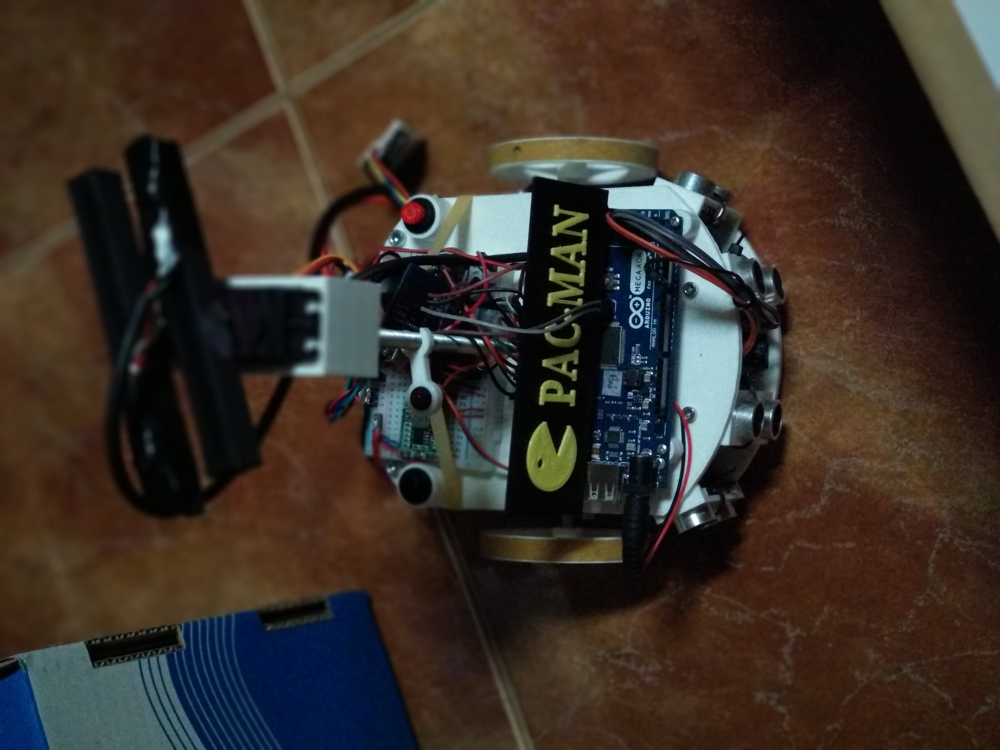

# PACMAN
## Micro Rato 2018
Neste repositório encontram o material necessário para criarem um robot micro-rato igual ao da nossa equipa. Disponibilizamos aqui:

* Modelos 3D
* Codigo para fazerem o vosso proprio farol emissor
* Esquema com as ligações de electronica
* Classes criadas por nós para aceder ao Hardware com alguns exemplos de utilização no código main
* Ferramenta de Debug em Python
* Relatório apresentado ao Juri

De forma a sermos mais eficientes, utilizamos o platformio para gerar os nossos makefiles, e utilizamos o CLion como IDE. Para comunicar com o robot usamos um ESP acoplado ao rato que tinha como função programar o rato remotamente via wifi. Entras aqui a respectiva documentação.

### O Robot:

### Visualização gráfica dos valores dos sensores, e utilização do "farol portatil":

### Ligações:

### Modelos 3D

Download: [https://www.thingiverse.com/thing:2939716](https://www.thingiverse.com/thing:2939716)

## Equipa

Fábio Ferreira, Rui Martins, Pedro Costa

---
Parabéns a toda a organização e aos restantes concorrentes.